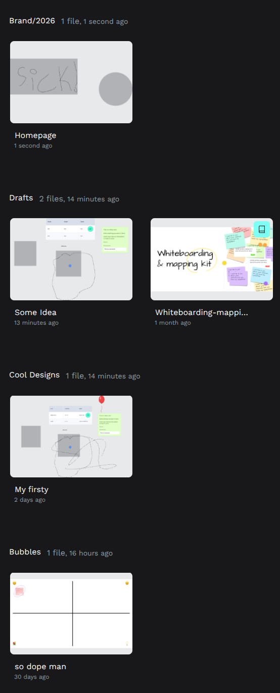
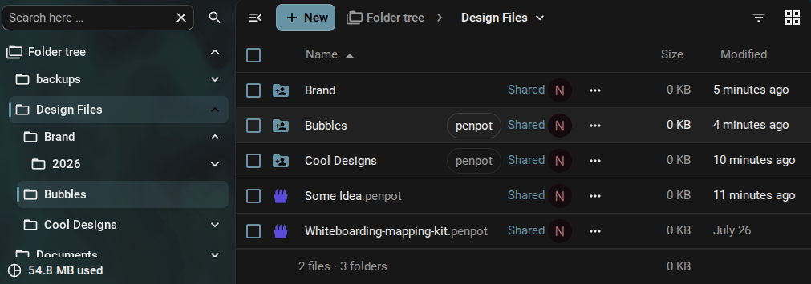
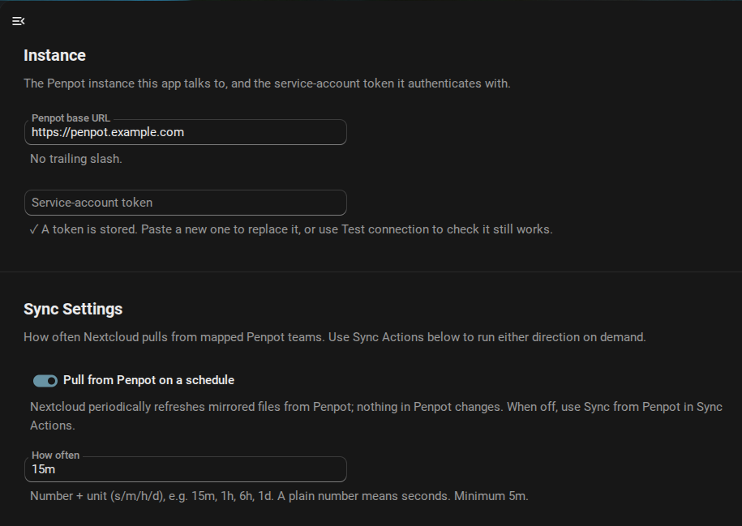
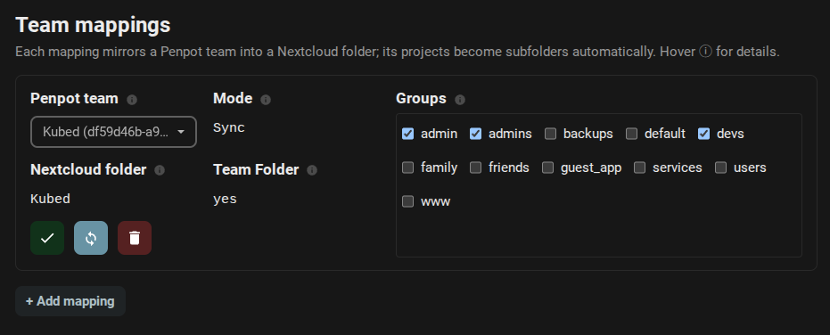
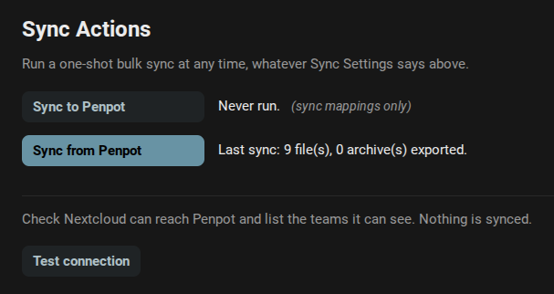

# Penpot Sync

**Your Penpot designs, living in Nextcloud as real files.** Browse them, file them into folders, rename them, copy them, trash them, restore them — and every one of those gestures lands in Penpot for real. 🎨

[](https://github.com/kubed-io/nextcloud-penpot/actions/workflows/tests.yml)
[](https://github.com/kubed-io/nextcloud-penpot/actions/workflows/quality.yml)
[](https://github.com/kubed-io/nextcloud-penpot/actions/workflows/integration.yml)
[](LICENSE)
[](https://apps.nextcloud.com)
[](composer.json)

<table>
<tr>
<td width="38%" valign="top"></td>
<td width="62%" valign="top"></td>
</tr>
<tr>
<td valign="top"><em>One Penpot team. <code>Brand/2026</code>, <code>Cool Designs</code>, <code>Bubbles</code> — and <strong>Drafts</strong>, which is where an unfiled design goes.</em></td>
<td valign="top"><em>The same team, mirrored. Each project is a folder; <code>Brand/2026</code> spells two of them. The two <strong>Drafts</strong> designs sit at the root, because that <em>is</em> Drafts.</em></td>
</tr>
</table>

---

## The whole idea, in one breath

Point the app at your Penpot instance, bind a Penpot **team** to a Nextcloud **folder**, and everything in that team shows up: projects become folders, designs become `.penpot` files.

```
Penpot                          Nextcloud
──────────────────────────      ─────────────────────────────
team     "Northwind"       ⟶    Northwind/
 └ project "Brand/2026"    ⟶    └── Brand/
                                    └── 2026/
    └ design "Homepage"    ⟶            └── Homepage.penpot
```

One project, two folders: a `/` in a Penpot project name is a path over here.

Drag a design into another folder and Penpot has re-filed it seconds later. Rename it in Penpot and the file renames itself. And a folder holding the real archives is quietly also the easiest backup you'll never have to think about. 💾

Nothing is matched on filename. Every file carries its design's **id**, so renaming, moving, copying, trashing and restoring never break the link — and re-running a sync never duplicates a thing. Ever. 🙅

---

## ✨ Create, read, update, delete — from either side

That's the pitch. Do it in Penpot, do it in Nextcloud, it doesn't matter:

| You do this… | …and this happens |
|---|---|
| **+ New → Penpot design** in a mapped folder | A real design appears in Penpot, in the project that folder spells |
| Create a design in Penpot | A file appears in the mapped folder |
| Drop a `.penpot` archive into a mapped folder | It's imported as a new design |
| Edit a design in Penpot | A stored archive is brought up to date |
| Rename a file or a folder | The design or the project is renamed |
| Rename either one in Penpot | The file or the folder follows |

Make a file *outside* a mapped folder and it stays a plain, untracked document, no strings attached.

📋 [`designs/create.feature`](features/designs/create.feature) · ✍️ [`designs/edit.feature`](features/designs/edit.feature) · 🔤 [`designs/rename.feature`](features/designs/rename.feature)

---

## 🗂️ The folder *is* the project

This is the part we're smug about. 😏

Penpot's hierarchy is rigid — team, then project, then design, and no sub-projects. Nextcloud is a file manager. So instead of forcing Penpot's flatness onto your folders, this teaches Penpot yours.

**A folder becomes a project the moment a design lands in it**, and the path spells the name:

```
Northwind/                     ← the mapped team
├── quick-thing.penpot         → a draft: under the team, under no project
├── Brand/                     ← project "Brand" 🏷
│   ├── Logo.penpot            →   …because a design landed in it
│   └── 2026/                  ← project "Brand/2026" 🏷
│       └── Homepage.penpot    →   …and the path is the project's name
└── Moodboards/                ← no designs in it, so it stays a plain folder
    └── notes.txt              ← never touched
```

It runs both ways: a project named `Brand/2026` in Penpot arrives here as the folders its name spells. Make a folder, drop a design in, and Penpot has a project named after the path to it. A folder holding **no** designs stays an ordinary folder, however much else is in it — notes, exports, whatever you like.

**Drafts is a state, not a folder.** Penpot calls a design that belongs to a team but no project a draft, and we never invent a `Drafts/` folder for it: sitting at the mapping root simply *is* being in Drafts. So filing a draft is a drag, and un-filing it is a drag back. The gesture you already know *is* the Penpot operation. 📥

A folder you promote from this side is tagged `penpot`, so the ones you made are easy to spot among your own folders.

🗂️ [`projects/create.feature`](features/projects/create.feature) · 🚚 [`projects/move.feature`](features/projects/move.feature) · 🔤 [`projects/rename.feature`](features/projects/rename.feature)

---

## 🚚 Move it, copy it, duplicate it

A **move** is always *the same design* going somewhere. A **copy** is always *a new one*. Simple rule, and the app is fanatical about it.

- **Move it between folders** — the design is re-filed into that project. Same id, same revision, same history.
- **Move it into another team's folder** — team and project change together, in one gesture. Nothing is re-created to get there.
- **Move it to the mapping root** — it becomes a draft. Drag it back into a folder to file it again.
- **Move it out of every mapped folder** — the file keeps its archive, and the design goes to Penpot's trash. You're holding the only live copy. 📦
- **Copy it** — always a brand-new design with its own id and its own name. Duplicating a design is now "Ctrl+C, Ctrl+V". 🍝
- **Duplicate it in Penpot** — the copy arrives here as its own file, alongside the original.

**Exactly one file per design, always.** Penpot happily lets three designs in one project share a name; Nextcloud can't. So they arrive as `Original.penpot`, `Original (2).penpot` and `Original (3).penpot` — one file each, all three still named `Original` upstream, and no later sync ever shuffles which is which.

🚚 [`designs/move.feature`](features/designs/move.feature) · 🍝 [`designs/copy.feature`](features/designs/copy.feature)

---

## 🗑️ Delete, restore, purge

Nextcloud's trash is reversible, and so is Penpot's — so trashing a design is reversible twice over. Nothing is destroyed until you say you mean it.

Trash a **sync** file and here's what Penpot does:

| Gesture | What Penpot does |
|---|---|
| 🗑️ Move to trash | Design goes to **Penpot's trash** — hidden, preserved |
| ↩️ Restore from trash | Design is **taken back out** — id, revision, history and deep links intact |
| 💥 Empty the trash | Design is **permanently deleted** |

It works from the Penpot side too: delete a design there and its file lands in the Nextcloud trash; restore it and the file comes back out. Delete it for good in Penpot and the trashed file is cleared. Personal trash, Team Folder trash — both. 🎯

The safety rails you'd hope for are all here: an **unmapped** file is just a file, so purging one leaves Penpot completely alone. Deleting a **link** is refused outright — a pointer is Penpot's copy to remove, not yours. And **emptying your trash only reaches a design still sitting in Penpot's** — restore it over there in the meantime and your purge leaves it be.

🗑️ [`designs/delete.feature`](features/designs/delete.feature) · ↩️ [`designs/restore.feature`](features/designs/restore.feature) · 💥 [`designs/purge.feature`](features/designs/purge.feature)

---

## 🎨 A first-class file type — icon, mimetype, honest timestamps

A mirrored design isn't a generic archive. The app registers the `application/vnd.penpot` mimetype, so your designs wear the **real Penpot icon** instead of a sad little zipper glyph.

Then there's the detail we're quietly proud of: **a mirror gets the timestamps of the thing it mirrors.** Penpot's `modified-at` becomes the file's modification time and `created-at` its creation time — because "the sync job wrote this file at 15:02" is never the question someone sorting a folder by date is actually asking. A design nobody has touched in a year should *look* like it. 🕰️

The payoff is that Nextcloud's own features just work on your designs, for free — recent files, sorting, search, the activity feed.

And every file's state is queryable over WebDAV. A raw `PROPFIND` hands back the design's identity in the XML:

| DAV property | What it holds |
|---|---|
| `nc:metadata-penpot_id` | The design's id in Penpot |
| `nc:metadata-penpot_revision` | The revision the file reflects |
| `nc:metadata-penpot_mode` | `sync`, `reference`¹ or `unmapped` — and it's **indexed** |

Folders carry `nc:metadata-penpot_project_id` and `nc:metadata-penpot_team_id` the same way. All of it is **read-only** — clients can't touch it with `PROPPATCH`; the sync engine owns it. Because `penpot_mode` is indexed, "find every stored archive" is a fast DAV query rather than a folder walk.

¹ `reference` is the on-the-wire value for **link** mode — Nextcloud's PROPFIND treats a stored `link` as a callback and falls over. Everywhere a human looks, it's **link**.

👀 [`designs/view.feature`](features/designs/view.feature)

---

## 🖱️ Open in Penpot

One opener, and it's the default click for every mirrored design:

- **Open in Penpot** — jumps straight to the live design. Built from the id the file already carries, so it keeps working after you rename the file or drag it somewhere else entirely.
- **No text editor, ever** — a `.penpot` file is a design archive, not a document. Penpot is where designs get edited, and nothing you type on this side reaches one.

🖱️ [`designs/open-with.feature`](features/designs/open-with.feature)

---

## 🧭 Sync or Link — the folder decides

Every mapping is one of two modes, and it applies to every design the mapping pulls. One knob, no per-file overrides to reason about.

| Mode | The file holds | Keeps a copy? |
|---|---|---|
| 🔗 **Link** *(default)* | A pointer — zero bytes | No — clicking it opens Penpot |
| 💾 **Sync** | The real `.penpot` archive | **Yes** — yours to open offline |

The mode decides whether the bytes live on your Nextcloud, never whether the design can be opened — both open identically.

A **link** is Penpot's copy, so Nextcloud treats it as read-only: it can't be trashed, copied, created or dragged out of its project from this side. A pointer that wandered would be an empty husk that looks like a design and isn't.

There's a third state you don't configure: **unmapped**. That's what a sync file *becomes* when you move it out of its folder — a real archive that no longer mirrors anything, and no sync will ever touch it again. A portable copy of a design. 📦

---

## 🛠 Setup, in three moves

**1. Point it at Penpot.** Base URL and an access token, stored encrypted and never echoed back. That is the whole connection. Each user can add their own token too, so the changes they make from Nextcloud are attributed to them in Penpot's history rather than to the app.



**2. Map a team to a folder.** Pick the Penpot team, name the folder, choose the mode, and pick which groups get to see it. Backed by a Team Folder or an admin-owned shared folder, your call. The team's projects come along automatically — there is no project-level mapping to configure and nothing that can drift from what Penpot actually contains.



**3. Sync it.** Scheduled pulls on whatever interval you like, plus one-shot **Sync from Penpot** and **Sync to Penpot** buttons whenever you're impatient — and "Test connection" so you're never guessing whether it works.



🔌 [`connection/admin.feature`](features/connection/admin.feature) · 🗂️ [`mapping/create.feature`](features/mapping/create.feature) · 🔄 [`connection/sync-now.feature`](features/connection/sync-now.feature)

---

## ⌨️ Every button is also a command

The whole setup is scriptable, so a Kubernetes init job can stand the thing up with no clicking. Exit `0` on success, non-zero on failure.

```sh
# Connect
occ penpot_sync:set-url https://penpot.example.com
occ penpot_sync:set-token "$PENPOT_TOKEN"
occ penpot_sync:test-connection

# Map a team to a folder
occ penpot_sync:list-teams
occ penpot_sync:add-mapping <team-id> --folder="Northwind" --mode=sync --groups=designers
occ penpot_sync:list-mappings
occ penpot_sync:set-groups <mapping-id> designers,admins
occ penpot_sync:remove-mapping <mapping-id>

# Sync — either direction, one mapping or all of them
occ penpot_sync:sync pull
occ penpot_sync:sync push
occ penpot_sync:sync pull --mapping=<mapping-id>

# Ask what the app makes of a file
occ penpot_sync:status "Northwind/Brand/2026/Homepage.penpot"
```

---

## 📋 The specs are the docs

Every feature above links to an **executable specification** — a Gherkin `.feature` file under [`features/`](features/) written in plain language, which also *drives the integration tests* against a real Nextcloud and a real Penpot. They're written before the code and kept true after it: a scenario counts as done only once CI has run it green. 🧪

Read [`features/README.md`](features/README.md) for how they're organised.

---

## 📜 Licence & trademark

AGPL-3.0-or-later. See [LICENSE](LICENSE).

This is a community integration and is not affiliated with, endorsed by, or sponsored by Penpot (Kaleidos Ventures SL). "Penpot" and the Penpot logo are trademarks of their respective owner, used here only to identify the service this app integrates with.
